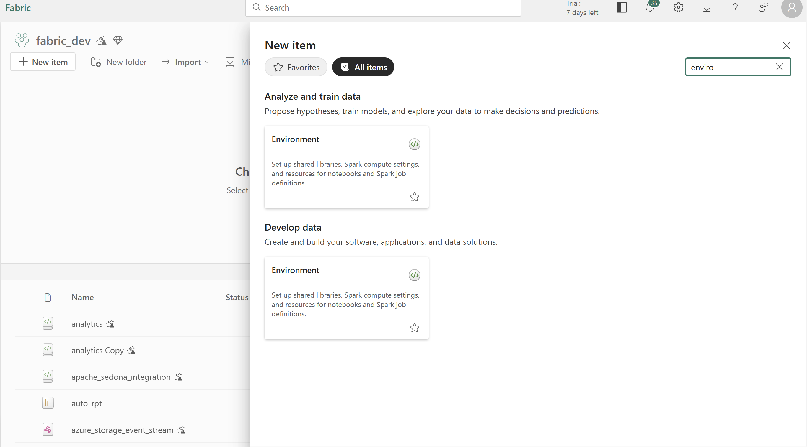
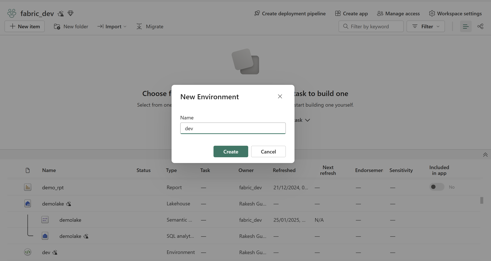
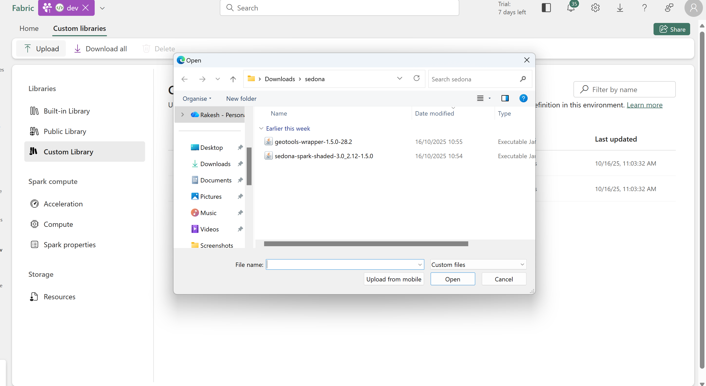
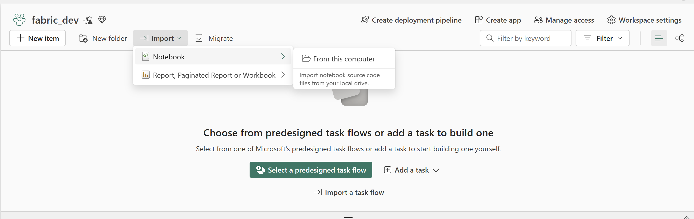
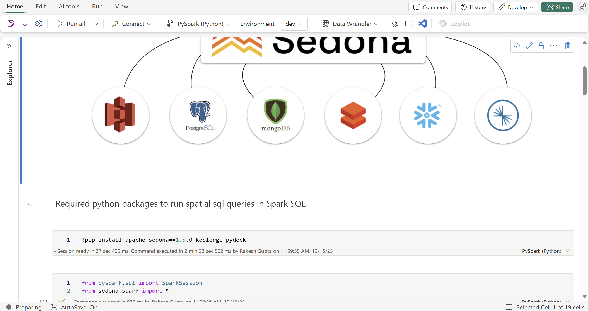

# Integrate Apache Sedona with MS Fabric

### Step 1: Clone the repo 

### Step 2: Open MS Fabric Workspace

### Step 3: Create an environment (https://learn.microsoft.com/en-us/fabric/data-engineering/create-and-use-environment)

Give your environment a name and Create.

### Step 4: Upload jar files from jar folder and publish to make them available in your spark environment. 

### Step 5: Import notebooks either from "py-format OR "notebook-format". 

### Step 6: Run imported notebooks and see Apache Sedona with MS Fabric integration in action.

Enjoy 😊

