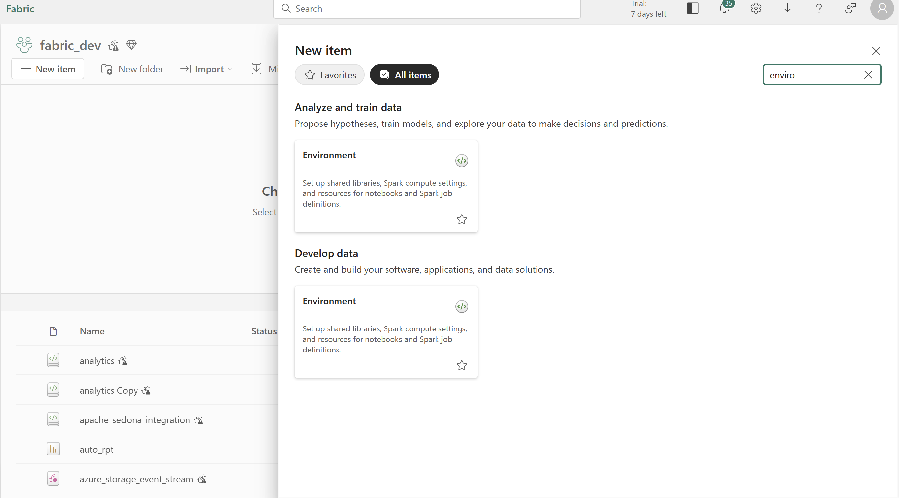

# Integrate Apache Sedona with MS Fabric

### Step 1: Clone the repo 

### Step 2: Open MS Fabric Workspace

### Step 3: Create an environment (https://learn.microsoft.com/en-us/fabric/data-engineering/create-and-use-environment)

